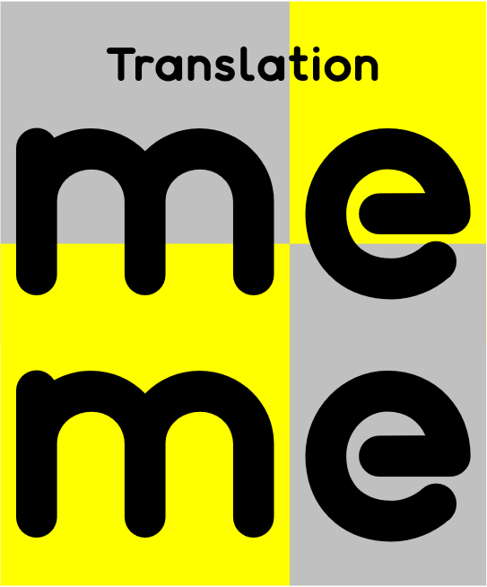

# meme Translation

# 简介

meme Translation 是一项通过将各国、各地区和各文化之间的“梗”互译的以促进跨文化交流传播的项目。

# meme(梗) 是什么

meme 是承载文化思想、符号或实践的一个包含甚广的单位，可以通过包括但不限于宗教、谣言、演讲、手势、新闻、知识、观念、习惯、习俗甚至口号、谚语、用语、写作、用字、网络爆红事物等仪式或其他具有模仿主题的可模仿现象从一个头脑传递到另一个头脑，近似于学习。（来自维基百科）

简单来说，就是我们经常说的的“梗”，或者说俚语、网络语言等。

# 现有的”梗百科“

指现在存在的查询“梗”的百科网站。

中文：小鸡词典 https://jikipedia.com/

英文：urban dictionary https://www.urbandictionary.com/  ； Know your MeMe https://knowyourmeme.com/

# 项目内容

将上述的“梗百科”翻译成其他语言。

比如，将小鸡词典上的条目翻译成英文。

# 原因

如果有外国人来中国留学或工作，或接触到了中文网络环境，势必会因为文化及语言的差异会对很多网络流行语和“梗”不了解。

比如，**666** 在圣经里是魔鬼的代号，而在中文网络上是有很厉害的意思。外国人会理解 **老铁** 的意思吗？如果我们可以很好地向他们解释，这可以让他们更好地融入中文网络环境中，更好地与中国朋友交流。反之，中国人去到其他国家中，如果能了解一些当国的“梗”，也会更好地与当地人交流。

# 意义

1. 有趣。
2. 可以发现各国、各地区和各文化的热点话题，发掘新鲜事。
3. 促进文化交流与传播。

